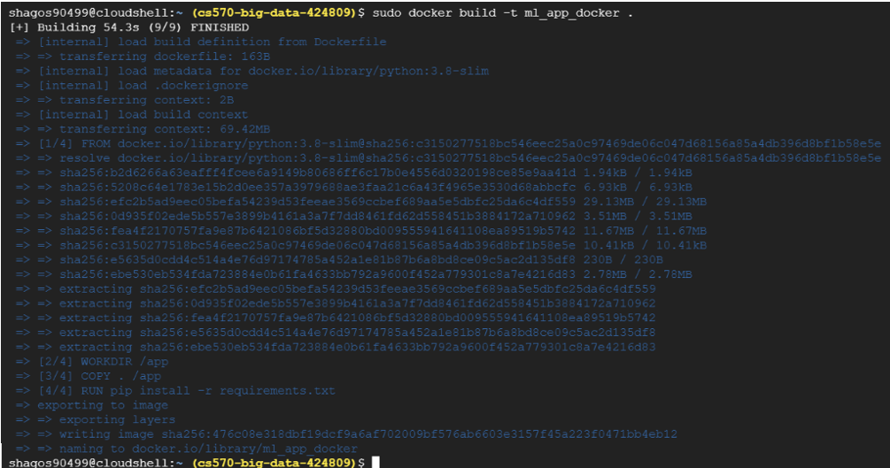
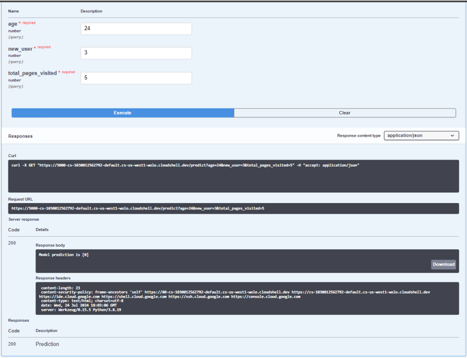
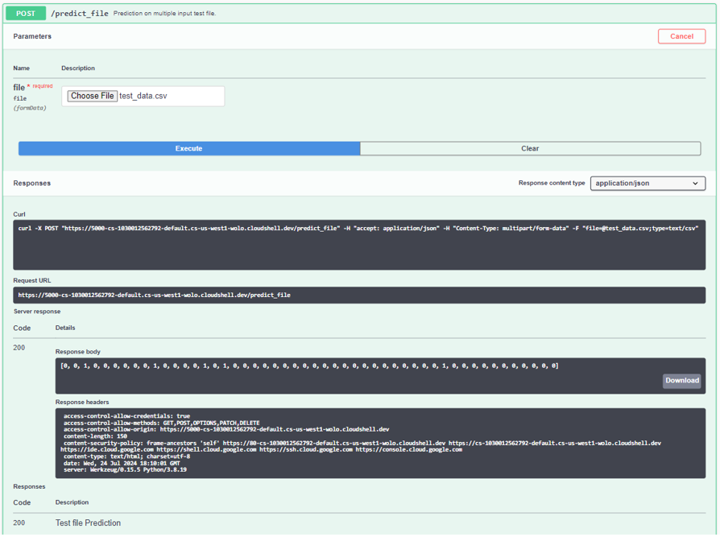

Sure, here's a comprehensive README file for your GitHub repository:

---

# Machine Learning on Kubernetes with Google Cloud Platform

## Contents

- [Introduction](#introduction)
- [Design](#design)
- [Implementation](#implementation)
  - [Environment Setup](#environment-setup)
  - [Flask API Development](#flask-api-development)
  - [Creating the Dockerfile](#creating-the-dockerfile)
  - [Building and Running the Docker Container](#building-and-running-the-docker-container)
  - [Testing the API](#testing-the-api)
  - [Managing Docker Containers](#managing-docker-containers)
- [Enhancement Ideas](#enhancement-ideas)
- [Conclusion](#conclusion)
- [References](#references)

## Project Objectives

This project demonstrates the deployment of a machine learning model using Docker and Kubernetes on Google Cloud Platform (GCP). The primary goal is to create a scalable and easily manageable machine learning application. The project includes:

- Studying basic machine learning algorithms.
- Setting up a Kubernetes cluster on GCP.
- Implementing a Flask API for model predictions.
- Containerizing the application using Docker.
- Deploying and testing the application in a Kubernetes environment.

## Design

### System Architecture

- **Components:**
  1. **Machine Learning Model:** Logistic Regression
  2. **API:** Flask framework
  3. **Containerization:** Docker
  4. **Orchestration:** Kubernetes on Google Cloud Platform

### Workflow

1. Train and serialize the machine learning model.
2. Develop a Flask API to serve the model.
3. Containerize the API using Docker.
4. Deploy the container to a Kubernetes cluster.
5. Access and test the API endpoints.

## Implementation

### Environment Setup

1. **Start Minikube in GCP:**
   - Initiate Minikube on Google Cloud Platform.
2. **Create `requirements.txt`:**
   - Use the command `nano requirements.txt` and add the following dependencies:
     ```plaintext
     Flask==1.1.1
     gunicorn==19.9.0
     itsdangerous==1.1.0
     Jinja2==2.10.1
     MarkupSafe==1.1.1
     Werkzeug==0.15.5
     numpy==1.19.5
     scipy>=0.15.1
     scikit-learn==0.24.2
     matplotlib>=1.4.3
     pandas>=0.19
     flasgger==0.9.4
     ```
3. **Upload `logreg.pkl` File:**
   - Download the file from this repo and then upload it to cloud shell
   - Click the three dots in the Cloud Shell Terminal, select "Upload", and upload `logreg.pkl`.
   

### Flask API Development

1. **Create `flask_api.py`:**
   - Use `nano flask_api.py` and add the following code:
     ```python
     # -*- coding: utf-8 -*-
     """
     Created on Mon May 25 12:50:04 2020
     @author: pramod.singh
     """
     from flask import Flask, request
     import numpy as np
     import pickle
     import pandas as pd
     from flasgger import Swagger

     app = Flask(__name__)
     Swagger(app)

     pickle_in = open("logreg.pkl", "rb")
     model = pickle.load(pickle_in)

     @app.route('/')
     def home():
         return "Welcome to the Flask API!"

     @app.route('/predict', methods=["GET"])
     def predict_class():
         """
         Predict if Customer would buy the product or not.
         ---
         parameters:
           - name: age
             in: query
             type: number
             required: true
           - name: new_user
             in: query
             type: number
             required: true
           - name: total_pages_visited
             in: query
             type: number
             required: true
         responses:
           200:
             description: Prediction
         """
         age = int(request.args.get("age"))
         new_user = int(request.args.get("new_user"))
         total_pages_visited = int(request.args.get("total_pages_visited"))
         prediction = model.predict([[age, new_user, total_pages_visited]])
         return "Model prediction is " + str(prediction)

     @app.route('/predict_file', methods=["POST"])
     def prediction_test_file():
         """
         Prediction on multiple input test file.
         ---
         parameters:
           - name: file
             in: formData
             type: file
             required: true
         responses:
           200:
             description: Test file Prediction
         """
         df_test = pd.read_csv(request.files.get("file"))
         prediction = model.predict(df_test)
         return str(list(prediction))

     if __name__ == '__main__':
         app.run(debug=True, host='0.0.0.0', port=5000)
     ```

### Creating the Dockerfile

1. **Create Dockerfile:**
   - Use the command `nano Dockerfile` and add the following content:
     ```Dockerfile
     FROM python:3.8-slim
     WORKDIR /app
     COPY . /app
     EXPOSE 5000
     RUN pip install -r requirements.txt
     CMD ["python", "flask_api.py"]
     ```

### Building and Running the Docker Container

1. **Build the Docker Image:**
   - Command: `sudo docker build -t ml_app_docker .`
   
2. **Run the Docker Container:**
   - Command: `docker container run -p 5000:5000 ml_app_docker`
   
3. **Access the Application:**
   - Use the web preview feature in the terminal and append `/apidocs/` to the URL for API documentation.
   
   
   ## Preview
   

### Testing the API

1. **GET Endpoint:**
   - Use the GET tab in the API documentation, provide input parameters, and execute.
   - Verify the model's prediction in the output.
   

2. **POST Endpoint:**
   - Use the POST tab to upload a CSV file for batch predictions.
   - Execute and verify the results.
   

### Managing Docker Containers

1. **List Running Containers:**
   - Command: `docker ps`
   
2. **Stop a Running Container:**
   - Command: `docker kill <CONTAINER_ID>`
   

## Enhancement Ideas

- **Scalability:**
  - Implement horizontal scaling for the API service in Kubernetes.
- **Monitoring and Logging:**
  - Integrate tools like Prometheus and Grafana for monitoring and logging.
- **CI/CD Pipeline:**
  - Set up a continuous integration and continuous deployment pipeline for automated testing and deployment.
- **Security:**
  - Implement secure communication between services using HTTPS and proper authentication mechanisms.

### Achievments

- Successfully deployed a machine learning model using Docker and Kubernetes on GCP.
- Demonstrated the ability to scale and manage the application in a cloud environment.

### Key Learnings

- Understanding of Kubernetes orchestration.
- Experience with containerizing applications using Docker.
- Practical implementation of a machine learning deployment pipeline.

## References

- **Resources:**
  - [Running a local single node Kubernetes cluster using Minikube](https://hc.labnet.sfbu.edu/~henry/sfbu/course/kubernetes_in_action/first_step/slide/Running_a_local_single_node_Kubernetes_cluster_with_Minikube.html)
  - [Deploying node js app](https://hc.labnet.sfbu.edu/~henry/sfbu/course/kubernetes_in_action/first_step/slide/Deploying_your_Nodejs_app.html)
  - [Flask Documentation](https://flask.palletsprojects.com/)
  - [Docker Documentation](https://docs.docker.com/)
  - [Machine Learning Algorithms](https://scikit-learn.org/stable/supervised_learning.html#supervised-learning)

## Appendix
- [Detailed Documentation PDF](https://github.com/siezer-5997/Cloud-Computing/blob/main/Kubernetes/Machine%20Learning/Machine%20Learning%20on%20Kubernetes%20detailed%20Documentation.pdf)
[GitHub Repo](https://github.com/siezer-5997/Cloud-Computing/tree/main/Kubernetes/Machine%20Learning)
[Detailed Slides Presentation](https://www.canva.com/design/DAGL4k5yqKE/-LzDNK_kWZXUaeyO8zYRiQ/edit?utm_content=DAGL4k5yqKE&utm_campaign=designshare&utm_medium=link2&utm_source=sharebutton)
---