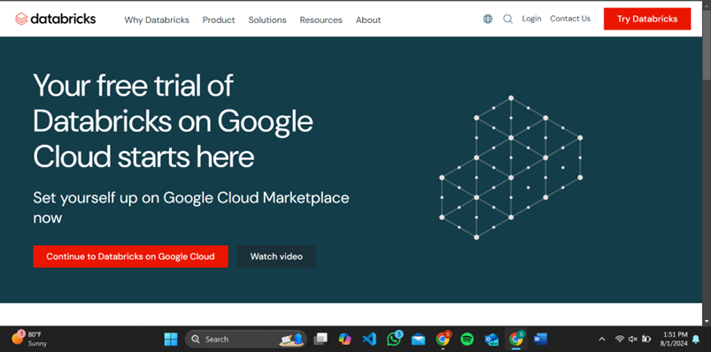
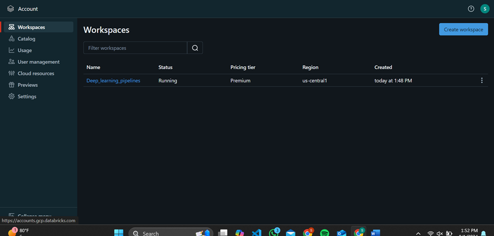
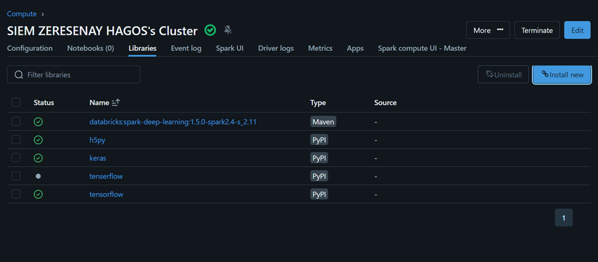

## README for Deep Learning Pipelines for Apache Spark

### Project Overview

This project demonstrates the integration of Deep Learning Pipelines (DLP) by Databricks with Apache Spark's MLlib Pipelines and Spark SQL to create a robust, scalable workflow for large-scale image processing. The goal is to build a pipeline that loads, processes, and performs transfer learning on a large dataset of images, showcasing the efficiency and scalability of deep learning on Spark.

### Table of Contents

1. [Introduction](#introduction)
2. [Project Setup](#project-setup)
3. [Data Preparation](#data-preparation)
4. [Model Training and Evaluation](#model-training-and-evaluation)
5. [Enhancement Ideas](#enhancement-ideas)
6. [Conclusion](#conclusion)
7. [References](#references)
8. [Appendix](#appendix)

### Introduction

Deep Learning Pipelines (DLP) by Databricks integrates deep learning libraries with Apache Spark's MLlib Pipelines and Spark SQL. It provides scalable APIs, facilitates model application on large datasets, and enables easy transfer learning. This project demonstrates the implementation of a deep learning pipeline for large-scale image datasets, including transfer learning and performance evaluation using Spark, to showcase an efficient workflow for deep learning in image processing.

### Project Setup

#### Step 1: Configuring the Cluster Environment

1. **Sign Up for Databricks and GCP**
   - Go to Databricks and sign up with your university email.
   
   - Choose "Continue to Databricks on GCP" and subscribe to the 14-day free trial.
   
   

2. **Create a Databricks Workspace**
   - Go to the Databricks website and create a workspace with default options.
   
   - Provide a workspace name and project ID from GCP, choose a region, and create the workspace.

3. **Create a Notebook and Cluster**
   - Create a new notebook in Databricks.
   - Create a new cluster and go to the cluster's Libraries section.

4. **Install Libraries**
   - Install the Deep Learning Pipelines library by entering `databricks:spark-deep-learning:1.5.0-spark2.4-s_2.11` in the Maven Coordinate field.
   - Install additional Python libraries: `tensorflow`, `keras`, and `h5py` via PyPI.
   

5. **Connect Notebook to Cluster**
   - Attach the notebook to the newly created cluster.

#### Step 2: Data Preparation
The following steps code sections are included in the ipynb file attached.

1. **Load and Move Images**
   - Download the flower dataset from the TensorFlow retraining tutorial.
   - Move the files to Databricks File System (DBFS) for processing.

2. **Create a Sample Set of Images**
   - Create a smaller sample set of images for quick demonstrations.

#### Step 3: Working with Images in Spark

1. **Load Images into DataFrame**
   - Use Deep Learning Pipelines utility functions to load and decode images into a Spark DataFrame for distributed processing.

2. **Transfer Learning**
   - Utilize transfer learning utilities provided by Deep Learning Pipelines to apply pre-trained models to the image dataset.

### Model Training and Evaluation

1. **Configure Deep Learning Pipelines**
   - Set up the DeepImageFeaturizer with a pre-trained model (e.g., InceptionV3).
   - Define a LogisticRegression classifier.
   - Create a pipeline combining the featurizer and classifier.

2. **Train and Evaluate Model**
   - Split the dataset into training and test sets.
   - Train the model using the training set.
   - Evaluate the model performance on the test set.

### Enhancement Ideas

1. **Experiment with Different Pre-trained Models**
   - Try different models like ResNet50 or VGG16 for transfer learning.
   
2. **Hyperparameter Tuning**
   - Optimize hyperparameters of the LogisticRegression classifier for better performance.

3. **Data Augmentation**
   - Implement data augmentation techniques to enhance the training dataset.

### Conclusion

This project successfully demonstrates the use of Deep Learning Pipelines with Apache Spark for scalable image processing. By leveraging Spark's distributed computing capabilities and pre-trained deep learning models, the pipeline efficiently handles large datasets and performs transfer learning with minimal code.

### References

- [Deep Learning Pipelines on Databricks](https://databricks-prod-cloudfront.cloud.databricks.com/public/4027ec902e239c93eaaa8714f173bcfc/5669198905533692/3647723071348946/3983381308530741/latest.html)
- Databricks Documentation
- TensorFlow Retraining Tutorial
- Apache Spark Documentation

### Appendix
[Google Slides presentation](https://docs.google.com/presentation/d/19pZvr-w3AJ2kJzTQGd_gBXCTEzmG31RmKKZcDRGcMjM/edit?usp=sharing)

---
