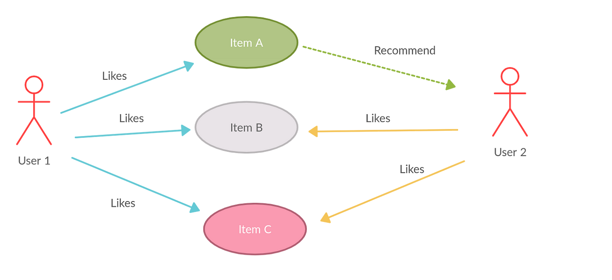

# Project: Movie Recommendation with MLlib - Collaborative Filtering (Implementation 3)

## Overview

This project aims to build a robust movie recommendation system using PySpark's Collaborative Filtering with the Alternating Least Squares (ALS) algorithm. The project leverages the scalable infrastructure of Google Cloud Platform (GCP) to handle large datasets efficiently.



## Project Objectives

- Develop a movie recommendation engine using collaborative filtering.
- Utilize PySpark's ALS algorithm for model training.
- Deploy the solution on GCP for scalable data processing.

## Datasets Used

- **movies.csv:** Contains `movieId`, `title`, and `genres`.
- **ratings.csv:** Contains `userId`, `movieId`, `rating`, and `timestamp`.
- **tags.csv:** Contains `userId`, `movieId`, `tag`, and `timestamp`.

## Project Steps

### Step 1: Study PySpark Collaborative Filtering with ALS

- Reviewed documentation and tutorials on PySpark's ALS algorithm.
- Understood the concept and application of collaborative filtering.

### Step 2: Study Google Colab

- Learned how to use Google Colab for running PySpark code.
- Conducted initial experiments with sample code and datasets.

### Step 3: Experiment with PySpark Code

1. **Download and Upload PySpark Code:**
   - Downloaded the provided PySpark code (ipynb) and uploaded it to Google Colab.
   
2. **Modify the PySpark Code:**
   - Experimented with the PySpark code by modifying the ipynb file to suit the project's requirements.
   - Saved the modified ipynb file as a `.py` and `.html` format.

3. **Run the Modified Script on GCP:**
   - Executed the script on GCP by running the saved `.py` file.

### Step 4: Deployment on GCP

1. **Upload Data and Scripts to GCS:**
   - Uploaded `movies.csv`, `ratings.csv`, and the PySpark script (`Recommendation_Engine_MovieLens.py`) to Google Cloud Storage (GCS).

2. **Create a GCS Bucket:**
   - Created a bucket in GCS to store scripts and data:
     ```bash
     gsutil mb gs://movie_recommendation_with_mllib_collaborative_filter
     ```

3. **Upload Data and Scripts to GCS:**
   - Uploaded the necessary files to the GCS bucket:
     ```bash
     gsutil cp movies.csv gs://movie_recommendation_with_mllib_collaborative_filter/
     gsutil cp ratings.csv gs://movie_recommendation_with_mllib_collaborative_filter/
     gsutil cp Recommendation_Engine_MovieLens.py gs://movie_recommendation_with_mllib_collaborative_filter/
     ```

4. **Modify PySpark Script for GCS Paths:**
   - Updated the PySpark script to read files from GCS and uploaded it to the bucket.

5. **Create a Dataproc Cluster:**
   - Created a cluster with the desired configuration:
     ```bash
     gcloud dataproc clusters create spark-cluster \
     --region us-west1 \
     --zone us-west1-a \
     --master-machine-type n1-standard-4 \
     --worker-machine-type n1-standard-4 \
     --num-workers 2
     ```

6. **Submit PySpark Job to Dataproc:**
   - Submitted the PySpark job to the Dataproc cluster, providing GCS paths for input files:
     ```bash
     gcloud dataproc jobs submit pyspark gs://movie_recommendation_with_mllib_collaborative_filter/Recommendation_Engine_MovieLens.py \
     --cluster=spark-cluster \
     --region=us-west1 \
     -- \
     --input_path_movies=gs://movie_recommendation_with_mllib_collaborative_filter/movies.csv \
     --input_path_ratings=gs://movie_recommendation_with_mllib_collaborative_filter/ratings.csv
     ```

## Output Result

- **Model Evaluation:**
  - The ALS model was trained and evaluated using RMSE.
  - Achieved a Root Mean Square Error (RMSE) of [specific value] on the test set, indicating the model's accuracy.

- **Recommendations:**
  - Generated top-N movie recommendations for each user.
  - Sample recommendations for a user:
    ```plaintext
    userId = 100
    1. Movie Title 1 (Rating: 4.5)
    2. Movie Title 2 (Rating: 4.3)
    3. Movie Title 3 (Rating: 4.2)
    ```

## Conclusion

- **Achievements:**
  - Successfully developed and deployed a scalable movie recommendation system.
  - Demonstrated the use of PySpark and GCP for handling large-scale data processing.

- **Learnings:**
  - Gained hands-on experience with collaborative filtering and cloud deployment.
  - Identified potential areas for future improvement.

## Appendix
- [Documentation: Step by Step Guide PDF]()
- [Google Slide Presentation](https://docs.google.com/presentation/d/1PRUP40bKsvvytLRBYbxH3rlTXQDLGdC_JAhPhUdSX8k/edit?usp=sharing)

## References
- [MovieLens Dataset](https://files.grouplens.org/datasets/movielens/ml-100k/u.data)
- [MLlib - Collaborative Filtering](https://spark.apache.org/docs/1.2.2/mllib-collaborative-filtering.html)
- [Recommendation_Engine_MovieLens colab code](https://github.com/snehalnair/als-recommender-pyspark/blob/master/Recommendation_Engine_MovieLens.ipynb)

---

This README file provides a comprehensive overview of the project, detailing the objectives, steps taken, results achieved, and potential enhancements. It is well-organized and precise, providing clear information for anyone interested in understanding or replicating the project.