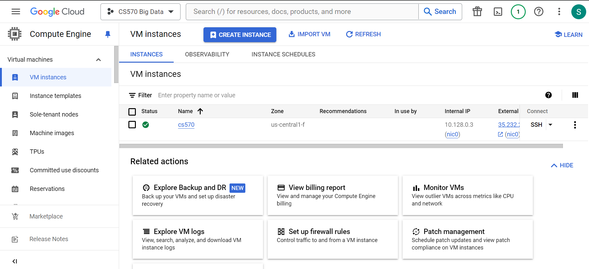
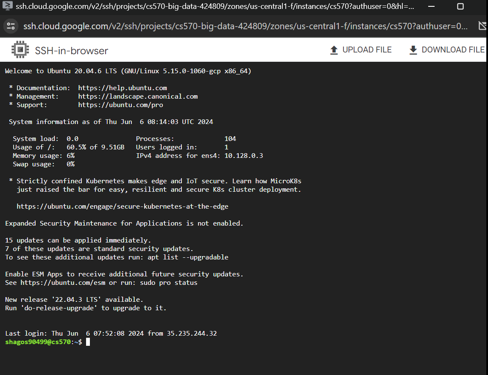
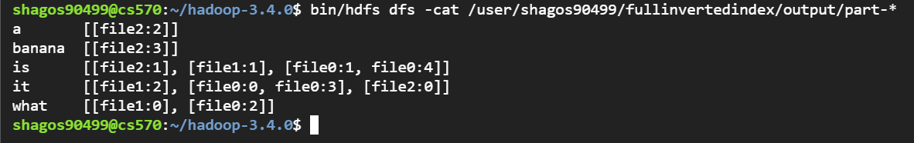

# MapReduce Program for Full Inverted Index

## Project Overview

This project demonstrates the use of MapReduce to create a Full Inverted Index from a set of three text files. The Full Inverted Index provides a mapping from words to their locations within a set of documents.

## Process

### Requirements

- **GCP Environment**
  - Google Cloud Platform for managing the Hadoop cluster.
  
  
- **Hadoop Environment**
  - Hadoop setup for running MapReduce jobs.
  

- **Java Environment**
  - Java Development Kit (JDK) for compiling and running Java programs in Ubuntu machine.

### Step 1: Connect to the VM Instance Using SSH

In case the public key permission is denied, connect using the following commands:
```sh
$ ssh-keygen -t rsa -P '' -f ~/.ssh/id_rsa
$ cat ~/.ssh/id_rsa.pub >> ~/.ssh/authorized_keys
$ chmod 0600 ~/.ssh/authorized_keys
```

### Step 2: Create the directory to work on and the Input Files and Necessary Java Files
```sh
$ mkdir FullInvertedIndex
$ cd FullInvertedIndex

```

**Create Java Files**:
```sh
$ vi InvertedIndex.java
$ vi InvertedIndexDriver.java
$ vi InvertedIndexMapper.java
$ vi InvertedIndexReducer.java
```


 **Create Input Files**:
 - In the same folder, FullInvertedIndex create an input folder to keep the input files
```sh
$ mkdir input
$ cd input
$ vi file0
$ vi file1
$ vi file2
```

3. **Navigate back to Hadoop Directory**:
```sh
$ cd ../hadoop-3.4.0/
```

### Step 2: Java Files Creation

4. **Create Java Files for MapReduce**:
    - Ensure necessary Java files for map-reduce are available. The codes are in the repo.

### Step 3: Compilation and Execution

5. **Copy Files to Hadoop Cluster**:
    - Create directories in HDFS:
```sh
$ bin/hdfs dfs -mkdir /user
$ bin/hdfs dfs -mkdir /user/shagos90499
$ bin/hdfs dfs -mkdir /user/shagos90499/fullinvertedindex
$ bin/hdfs dfs -mkdir /user/shagos90499/fullinvertedindex/input
```
- Copy all the input files to HDFS:
```sh
$ bin/hdfs dfs -put ../FullInvertedIndex/input/* /user/shagos90499/fullinvertedindex/input
# check if the files are copied and exist
$ bin/hdfs dfs -ls /user/shagos90499/fullinvertedindex/input
```


6. **Compile Java Code**:
- Go to the directory where the Java files are located and complile the code:
```sh
$ cd FullInvertedIndex
$ javac -classpath $(~/hadoop-3.4.0/bin/hadoop classpath) *.java
```

7.  First, go back to hadoop and copy the complied Java files to that directory
```sh
$ cd ../hadoop-3.4.0/
$ cp ../FullInvertedIndex/*.class .
$ cp ../FullInvertedIndex/*.java .
```

 **Create JAR File**:
```sh
$ jar cf inverted-index.jar *.class
```

8. **Submit and Run Job**:
```sh
bin/hadoop jar inverted-index.jar InvertedIndex /user/shagos90499/fullinvertedindex/input /user/shagos90499/fullinvertedindex/output
```

### Step 4: Output Verification

9. **Verify Output**:
```sh
bin/hdfs dfs -ls /user/shagos90499/fullinvertedindex/output
bin/hdfs dfs -cat /user/shagos90499/fullinvertedindex/output/part-*
```


## Code Explanation

- The mapper emits key-value pairs where the key is a word and the value is a location (file and index).
- The reducer combines these values for each word into a set of unique locations and emits the word with its associated locations.


