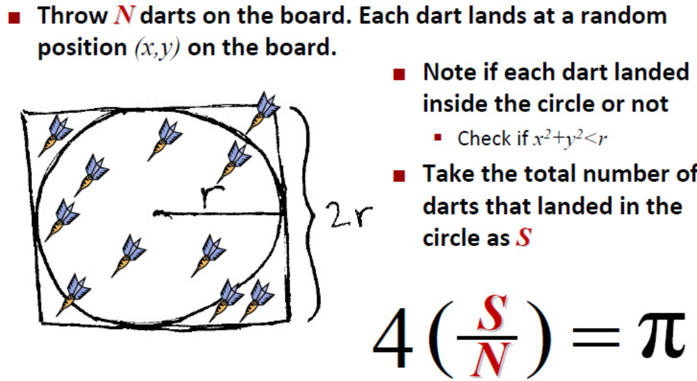
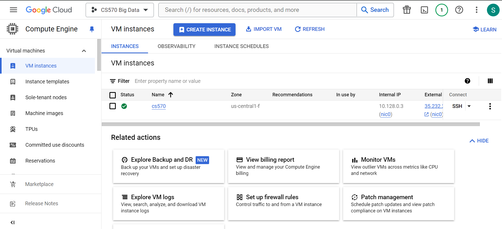
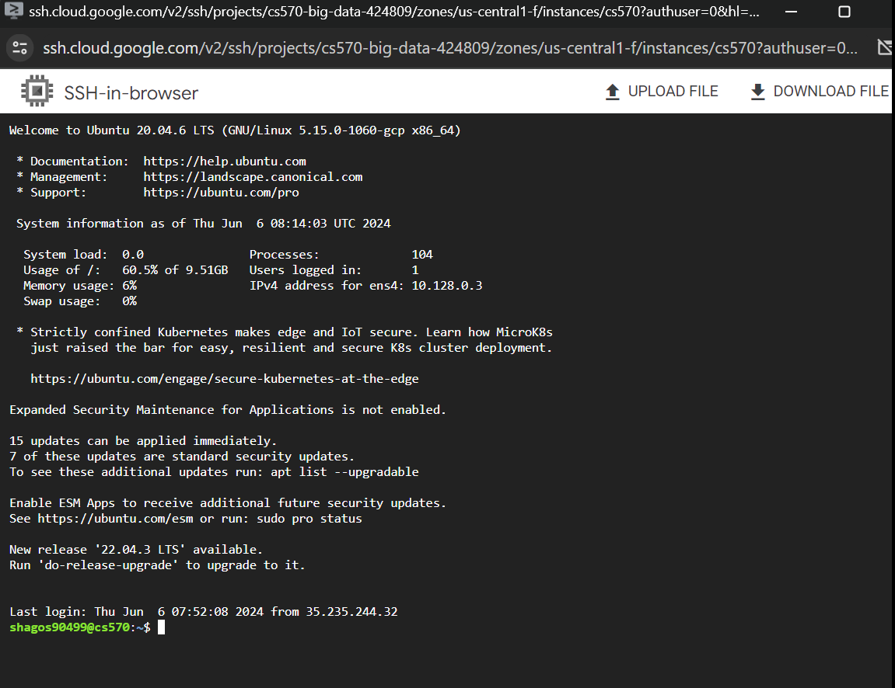

# Pi Calculation using MapReduce

## Project Overview

This project demonstrates the use of MapReduce to calculate the value of Pi by simulating the process of throwing darts at a square board with a quarter circle inscribed within it. The ratio of darts that land inside the quarter circle to the total number of darts thrown can be used to estimate the value of Pi.



## Design


### Step 1: Generate an Input File for the Pi MapReduce Program 

#### Step 1.1: Create a Regular Java Program

- **Description**: Write a Java program that accepts two command line arguments:
  - `R`: The radius of the circle.
  - `N`: The number of (x, y) pairs to create.
- **Functionality**: The program will randomly generate `N` pairs of (x, y) coordinates and display them on the standard output.

#### Step 1.2: Run the Java Program and Save the Output

- **Description**: Execute the Java program created in Step 1.1 and save the output to a file.
- **Purpose**: This file will serve as the input for the MapReduce program created in Step 2.

### Step 2: Create a MapReduce Program

- **Description**: Develop a MapReduce program that processes the input file to count the number of darts that fall inside and outside the quarter circle.

### Step 3: Execute the MapReduce Program

- **Description**: Use the file generated in Step 1.2 as input to run the MapReduce program created in Step 2.

### Step 4: Calculate Pi

- **Description**: Write a driver program to calculate the value of Pi based on the numbers of inside and outside darts obtained from the MapReduce program.

## Implementation

### Requirements

- **GCP Environment**
  - Google Cloud Platform for managing the Hadoop cluster.
  
  
- **Hadoop Environment**
  - Hadoop setup for running MapReduce jobs.
  

- **Java Environment**
  - Java Development Kit (JDK) for compiling and running Java programs in Ubuntu machine.

### Preparing Input Data

1. **Create Directory for Pi Calculation**:
    ```sh
    $ mkdir PiCalculation
    $ cd PiCalculation
    ```

2. **Generate Random Numbers**:
    ```sh
    $ vi GenerateRandomNumbers.java
    $ javac GenerateRandomNumbers.java
    $ java -cp . GenerateRandomNumbers R N > PiCalculationInput
    ```

### Setup Passphraseless SSH

1. **Check SSH to Localhost**:
    ```sh
    $ cd hadoop-3.3.4/
    $ ssh localhost
    ```

2. **if connection to ssh is not established, Setup SSH Key**:
    ```sh
    $ ssh-keygen -t rsa -P '' -f ~/.ssh/id_rsa
    $ cat ~/.ssh/id_rsa.pub >> ~/.ssh/authorized_keys
    $ chmod 0600 ~/.ssh/authorized_keys
    ```

### Hadoop HDFS Setup

1. **Format Namenode and Start HDFS**:
    ```sh
    $ cd ..
    $ cd hadoop-3.3.4/
    $ bin/hdfs namenode -format
    $ sbin/start-dfs.sh
    ```

2. **Create Directories in HDFS**:
    ```sh
    $ bin/hdfs dfs -mkdir /user
    $ bin/hdfs dfs -mkdir /user/username
    $ bin/hdfs dfs -mkdir /user/username/picalculate
    $ bin/hdfs dfs -mkdir /user/username/picalculate/input
    $ bin/hdfs dfs -put ../PiCalculation/PiCalculationInput /user/username/picalculate/input
    ```

### Prepare Code

1. **Write and Compile MapReduce Program**:
    ```sh
    $ cd /hadoop-3.3.4
    $ vi PiCalculation.java
    $ bin/hadoop com.sun.tools.javac.Main PiCalculation.java
    $ jar cf wc.jar PiCalculation*class
    ```

### Run the MapReduce Program

1. **Execute the Program**:
    ```sh
    $ bin/hadoop jar wc.jar PiCalculation /user/username/picalculate/input /user/username/picalculate/output
    ```

2. **View the Output**:
    ```sh
    $ bin/hdfs dfs -ls /user/username/picalculate/output
    $ bin/hdfs dfs -cat /user/username/picalculate/output/part-r-00000
    ```

### Shutdown Hadoop

1. **Stop HDFS**:
    ```sh
    $ sbin/stop-dfs.sh
    ```


