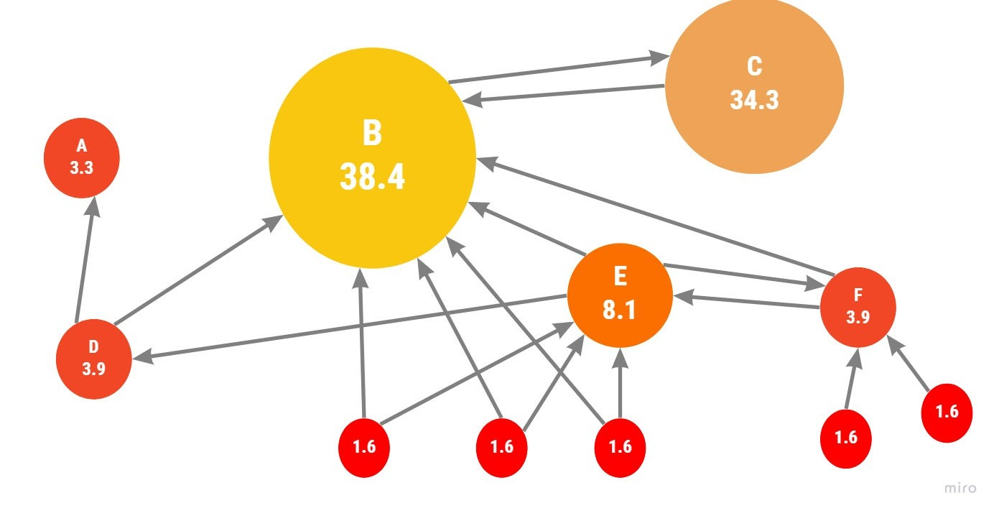
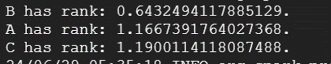
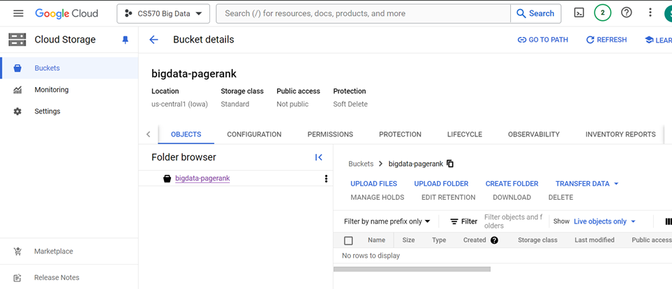

# PageRank on Google Cloud Platform

This project demonstrates the implementation of the PageRank algorithm using both PySpark and Scala on Google Cloud Platform (GCP) using Google Cloud Dataproc.



## Table of Contents

- [Introduction](#introduction)
- [Setup and Configuration](#setup-and-configuration)
  - [Prerequisites](#prerequisites)
  - [Create a Google Cloud Storage Bucket](#create-a-google-cloud-storage-bucket)
  - [Create a Dataproc Cluster](#create-a-dataproc-cluster)
- [Part One: Run Using PySpark](#part-one-run-using-pyspark)
  - [Prepare the PySpark Script](#prepare-the-pyspark-script)
  - [Upload the Script to the Bucket](#upload-the-script-to-the-bucket)
  - [Submit the PySpark Job](#submit-the-pyspark-job)
  - [Check Output](#check-output)
- [Part Two: Run Using Scala](#part-two-run-using-scala)
  - [Set Up Project Structure and Compile Code](#set-up-project-structure-and-compile-code)
  - [Upload Compiled JAR to Google Cloud Storage](#upload-compiled-jar-to-google-cloud-storage)
  - [Submit Spark Job on Dataproc](#submit-spark-job-on-dataproc)
- [Output](#output)
- [Contributing](#contributing)
- [License](#license)

## Introduction

This project demonstrates how to implement the PageRank algorithm on Google Cloud Platform using PySpark and Scala. PageRank is an algorithm used by Google Search to rank web pages in their search engine results. It is based on the idea that the importance of a page is determined by the number and quality of links to it.

## Setup and Configuration

### Prerequisites

- Google Cloud Platform account
- Google Cloud SDK installed
- Python and Scala installed locally

### Create a Google Cloud Storage Bucket

```sh
gsutil mb gs://bigdata-pagerank/
```


### Create a Dataproc Cluster

```sh
gcloud dataproc clusters create pagerank-cluster \
    --region=us-central1 \
    --zone=us-central1-a \
    --single-node \
    --master-machine-type=n1-standard-4 \
    --master-boot-disk-size=50GB \
    --image-version=1.5-debian10
```

## Part One: Run Using PySpark

### Prepare the PySpark Script

Save the following `pagerank.py` script:

```python
import re
import sys
from operator import add
from pyspark.sql import SparkSession

def computeContribs(urls, rank):
    num_urls = len(urls)
    for url in urls:
        yield (url, rank / num_urls)

def parseNeighbors(urls):
    parts = re.split(r'\s+', urls)
    return parts[0], parts[1]

if __name__ == "__main__":
    if len(sys.argv) != 3:
        print("Usage: pagerank <file> <iterations>", file=sys.stderr)
        sys.exit(-1)

    spark = SparkSession.builder.appName("PythonPageRank").getOrCreate()
    lines = spark.read.text(sys.argv[1]).rdd.map(lambda r: r[0])
    links = lines.map(lambda urls: parseNeighbors(urls)).distinct().groupByKey().cache()
    ranks = links.map(lambda url_neighbors: (url_neighbors[0], 1.0))

    for iteration in range(int(sys.argv[2])):
        contribs = links.join(ranks).flatMap(
            lambda url_urls_rank: computeContribs(url_urls_rank[1][0], url_urls_rank[1][1]))
        ranks = contribs.reduceByKey(add).mapValues(lambda rank: rank * 0.85 + 0.15)

    for (link, rank) in ranks.collect():
        print("%s has rank: %s." % (link, rank))
    spark.stop()
```

### Upload the Script to the Bucket

```sh
gsutil cp pagerank.py gs://bigdata-pagerank/
```

### Submit the PySpark Job

```sh
gcloud dataproc jobs submit pyspark gs://bigdata-pagerank/pagerank.py \
    --cluster=pagerank-cluster \
    --region=us-central1 \
    -- gs://bigdata-pagerank/input.txt 10
```

### Check Output

Go to the URL provided in the output using `gsutil ls {url}`.
Then `gsutil cat {url of output}`

- The output should look something like this.


## Part Two: Run Using Scala

### Set Up Project Structure and Compile Code

1. SSH to the Cluster:

```sh
gcloud compute ssh --zone us-central1-a pagerank-cluster-m
```

2. Update System Packages:

```sh
sudo apt-get update
```

3. Install Scala:

```sh
sudo apt-get install scala
```

4. Install sbt (Scala Build Tool):

```sh
echo "deb https://repo.scala-sbt.org/scalasbt/debian all main" | sudo tee /etc/apt/sources.list.d/sbt.list
curl -sL "https://keyserver.ubuntu.com/pks/lookup?op=get&search=0x642AC823" | sudo apt-key add
sudo apt-get update
sudo apt-get install sbt
```

5. Set Up Project Structure and Compile Code:

```sh
mkdir pagerank
cd pagerank
mkdir -p src/main/scala
```

6. Create `build.sbt` file:

```sh
vi build.sbt
```

```sbt
name := "SparkPageRank"
version := "1.0"
scalaVersion := "2.12.10"
libraryDependencies ++= Seq(
  "org.apache.spark" %% "spark-core" % "2.4.5",
  "org.apache.spark" %% "spark-sql" % "2.4.5"
)
```

7. Create `SparkPageRank.scala` file:

```sh
vi src/main/scala/SparkPageRank.scala
```

```scala
package org.apache.spark.examples

import org.apache.spark.SparkContext._
import org.apache.spark.{SparkConf, SparkContext}

object SparkPageRank {

  def showWarning() {
    System.err.println(
      """WARN: This is a naive implementation of PageRank and is given as an example!
        |Please use the PageRank implementation found in org.apache.spark.graphx.lib.PageRank
        |for more conventional use.
      """.stripMargin)
  }

  def main(args: Array[String]) {
    if (args.length < 1) {
      System.err.println("Usage: SparkPageRank <file> <iter>")
      System.exit(1)
    }

    showWarning()

    val sparkConf = new SparkConf().setAppName("PageRank")
    val iters = if (args.length > 1) args(1).toInt else 10
    val ctx = new SparkContext(sparkConf)
    val lines = ctx.textFile(args(0), 1)
    
    val links = lines.map{ s =>
      val parts = s.split("\\s+")
      (parts(0), parts(1))
    }.distinct().groupByKey().cache()

    var ranks = links.mapValues(v => 1.0)

    for (i <- 1 to iters) {
      val contribs = links.join(ranks).values.flatMap{ case (urls, rank) =>
        val size = urls.size
        urls.map(url => (url, rank / size))
      }
      ranks = contribs.reduceByKey(_ + _).mapValues(0.15 + 0.85 * _)
    }

    val output = ranks.collect()
    output.foreach(tup => println(tup._1 + " has rank: " + tup._2 + "."))

    ctx.stop()
  }
}
```

8. Compile the Project:

```sh
sbt package
```

### Upload Compiled JAR to Google Cloud Storage

```sh
gsutil cp target/scala-2.12/sparkpagerank_2.12-1.0.jar gs://bigdata-pagerank-scala/
```

### Submit Spark Job on Dataproc

```sh
gcloud dataproc jobs submit spark --cluster=pagerank-cluster --region=us-central1 \
    --jars=gs://bigdata-pagerank-scala/sparkpagerank_2.12-1.0.jar \
    --class=org.apache.spark.examples.SparkPageRank \
    -- gs://bigdata-pagerank-scala/input.txt 10
```

## Output

Check the output files generated by the Dataproc jobs in your Google Cloud Storage bucket.

## Contributing

If you'd like to contribute, please fork the repository and use a feature branch. Pull requests are warmly welcome.

## License

This project is licensed under the MIT License.

---

You can create a new repository on GitHub and add this README.md file to document the steps and procedures involved in the project.