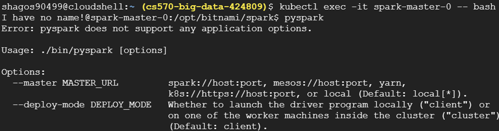
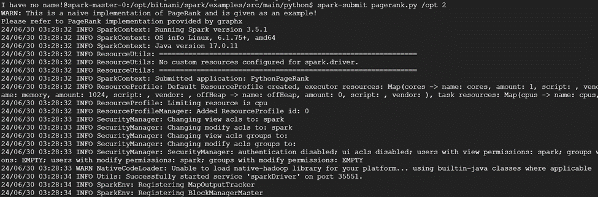

---

# PySpark on Kubernetes: Word Count + PageRank

## Project Overview

This project demonstrates how to set up and run Apache Spark jobs (Word Count and PageRank) on a Kubernetes cluster managed by Google Kubernetes Engine (GKE). The steps include creating a GKE cluster, deploying an NFS server for shared storage, preparing application JAR files, and submitting Spark jobs. The project covers resolving issues encountered during job submission and viewing job outputs.

## Prerequisites

- Google Cloud SDK
- Helm
- kubectl
- Docker

## Steps to Implement the Project

### 1. Create a GKE Cluster

```sh
gcloud container clusters create spark --num-nodes=1 --machine-type=e2-highmem-2 --region=us-west1
```

### 2. Install the NFS Server Provisioner

```sh
helm repo add stable https://charts.helm.sh/stable
helm install nfs stable/nfs-server-provisioner --set persistence.enabled=true,persistence.size=5Gi
```

### 3. Create Persistent Volume and Pod

Create `spark-pvc.yaml`:

```yaml
kind: PersistentVolumeClaim
apiVersion: v1
metadata:
  name: spark-data-pvc
spec:
  accessModes:
    - ReadWriteMany
  resources:
    requests:
      storage: 2Gi
  storageClassName: nfs
---
apiVersion: v1
kind: Pod
metadata:
  name: spark-data-pod
spec:
  volumes:
    - name: spark-data-pv
      persistentVolumeClaim:
        claimName: spark-data-pvc
  containers:
    - name: inspector
      image: bitnami/minideb
      command: ["sleep", "infinity"]
      volumeMounts:
        - mountPath: "/data"
          name: spark-data-pv
```

Apply the YAML descriptor:

```sh
kubectl apply -f spark-pvc.yaml
```

### 4. Create and Prepare Your Application JAR File

```sh
docker run -v /tmp:/tmp -it bitnami/spark -- find /opt/bitnami/spark/examples/jars/ -name spark-examples* -exec cp {} /tmp/my.jar \;
```

### 5. Add a Test File

```sh
echo "how much wood could a woodpecker chuck if a woodpecker could chuck wood" > /tmp/test.txt
```

### 6. Copy Files to PVC

```sh
kubectl cp /tmp/my.jar spark-data-pod:/data/my.jar
kubectl cp /tmp/test.txt spark-data-pod:/data/test.txt
```

### 7. Verify Files Inside the Persistent Volume

```sh
kubectl exec -it spark-data-pod -- ls -al /data
```

### 8. Deploy Spark on Kubernetes Using the Shared Volume

Create `spark-chart.yaml`:

```yaml
service:
  type: LoadBalancer
worker:
  replicaCount: 3
  extraVolumes:
    - name: spark-data
      persistentVolumeClaim:
        claimName: spark-data-pvc
  extraVolumeMounts:
    - name: spark-data
      mountPath: /data
```

Deploy Apache Spark:

```sh
helm repo add bitnami https://charts.bitnami.com/bitnami
helm install spark bitnami/spark -f spark-chart.yaml
```

### 9. Get External IP

```sh
kubectl get svc -l "app.kubernetes.io/instance=spark,app.kubernetes.io/name=spark"
```

### 10. Open the External IP in Your Browser

### 11. Submit Word Count Task

```sh
kubectl run --namespace default spark-client --rm --tty -i --restart='Never' \
--image docker.io/bitnami/spark:3.0.1-debian-10-r115 \
-- spark-submit --master spark://<external-ip>:7077 \
--deploy-mode cluster --class org.apache.spark.examples.JavaWordCount \
/data/my.jar /data/test.txt
```

**If the job fails, SSH into the master node and submit the job from there:**

```sh
kubectl exec -it spark-master-0 -- spark-submit --master spark://<external-ip>:7077 \
--deploy-mode cluster --class org.apache.spark.examples.JavaWordCount \
/data/my.jar /data/test.txt
```

### 12. View Output of Completed Jobs

- Get the worker node IP address from the browser.
- Find the name of the worker node:

  ```sh
  kubectl get pods -o wide | grep <WORKER-NODE-ADDRESS>
  ```

- Execute the pod and see the result:

  ```sh
  kubectl exec -it <worker-node-name> -- bash
  cd /opt/bitnami/spark/work
  cat <taskname>/stdout
  ```

### 13. Running PageRank on PySpark

- Execute the Spark master pod:

  ```sh
  kubectl exec -it spark-master-0 -- bash
  ```

- Start PySpark:

  ```sh
  pyspark
  ```

  If you encounter an error that pyspark is not supported like below, use the following script to resolve it:
  

  ```sh
  export PYTHONPATH=/opt/bitnami/spark/python/lib/py4j-0.10.9.7-src.zip:/opt/bitnami/spark/python/:/opt/bitnami/spark/python/
  export PYTHONSTARTUP=/opt/bitnami/spark/python/pyspark/shell.py
  exec "${SPARK_HOME}"/bin/spark-submit pyspark-shell-main
  
  ```
  Once PySpark is running fine, exit off pyspark back to the master node bash shell.
  ```sh
  exit()
  ```

- Run PageRank:

  ```sh
  cd /opt/bitnami/spark/examples/src/main/python
  spark-submit pagerank.py /opt 2
  ```

  Note: `/opt` is an example directory, and `2` is the number of iterations you want the PageRank to run.

  - Output:
  

## Google Slide Presentation
For a detailed presentation on the project, refer to the [Google Slide Presentation] (https://docs.google.com/presentation/d/1Q9lumgsJq4cdy9RGK2g1tZO7baJUhw7m0eLrGtQK8hU/edit?usp=sharing)

---
